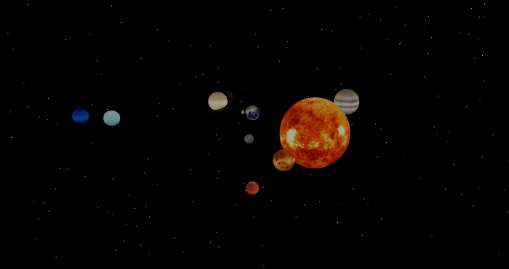

# 3D Solar System

Este proyecto representa un modelo básico del sistema solar en 3D utilizando React y Three.js a través de react-three-fiber.

## Demostración

[Enlace a la demostración en vivo](https://3-d-solar-system-virid.vercel.app/).

## Capturas de pantalla

## Características

- Modelado 3D del sistema solar con planetas en órbita alrededor del sol.
- Animaciones para simular rotación y traslación de los planetas.
- Controles de órbita para explorar el sistema solar.

## Tecnologías Utilizadas

- React
- Three.js
- react-three-fiber
- styled-components

## Instalación

1. Clona este repositorio: `git clone https://github.com/tu-usuario/3D-Solar-System.git`
2. Navega al directorio del proyecto: `cd 3D-Solar-System`
3. Instala las dependencias: `npm install`
4. Inicia la aplicación: `npm start`

## Uso

- Usa los controles de órbita para explorar el sistema solar.
- Disfruta de la representación 3D de los planetas en movimiento.

## Contribuciones

Puedes encontrar texturas de planetas en: 
[Solar System Scope](https://www.solarsystemscope.com/textures/).

## Licencia

Este proyecto está bajo la Licencia [MIT](LICENSE).
